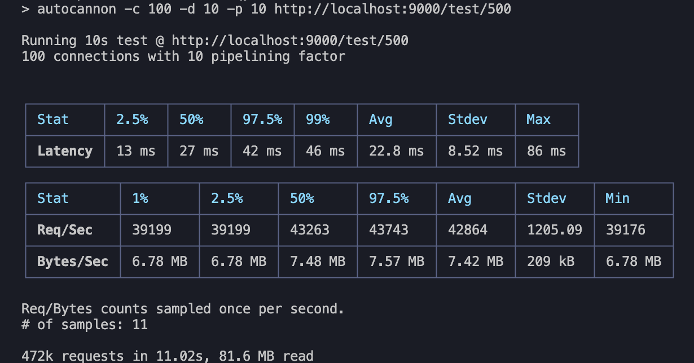
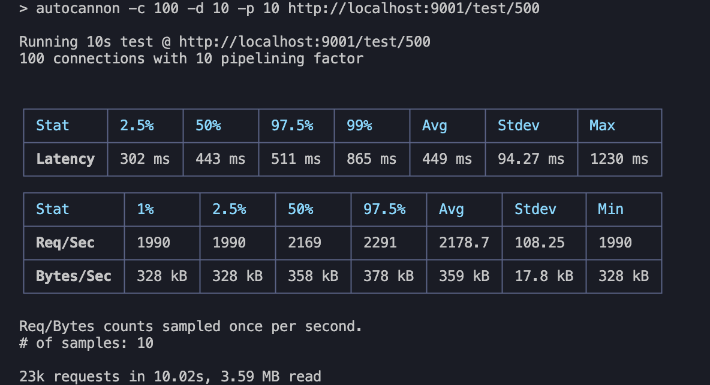
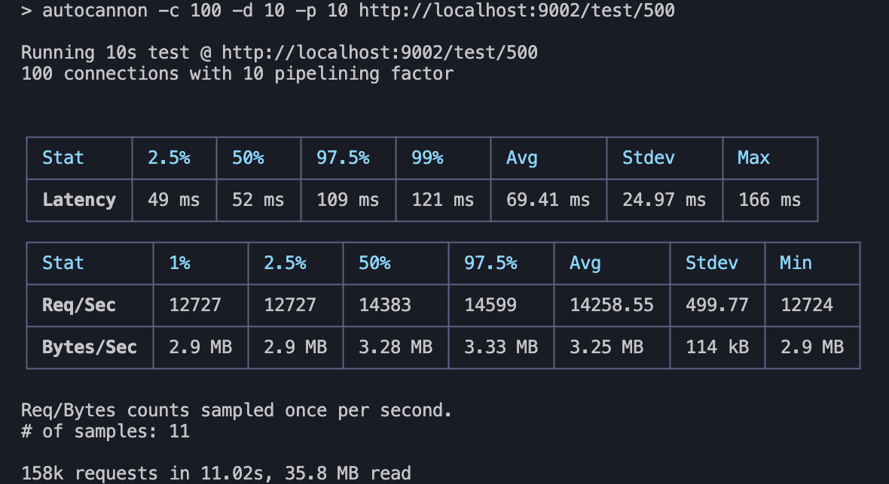
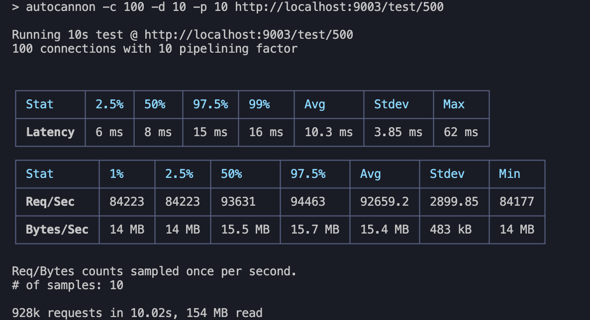

# Vivid

A tiny, rapid http framework.

Similar to Express, but built with async/await, and much faster.

# Install

```
npm install vivid
```

# Usage

```
const Vivid = require('@vivid/core')
const router = require('@vivid/router')()

const app = new Vivid()

router.get('/', async function (req, res) {
  res.body = 'Hello Vivid!'
})

app.use(router.routes())

app.listen(3000)

```

# Performance

Performance test with autocannon

- vivid



- koa



- express



- fastify



Signpost is faster than koa and express.

# Licence

MIT
